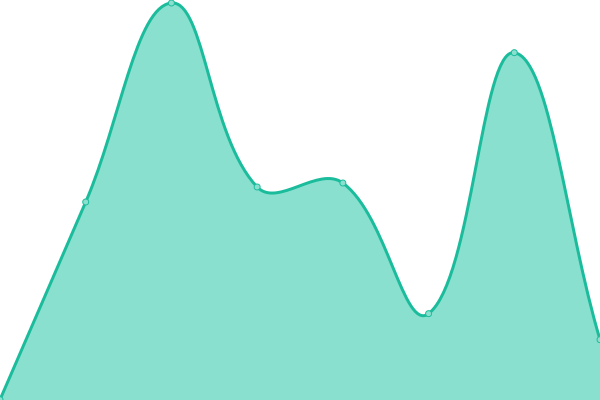

# [📈 Live Status](https://dlt-web.github.io/status): <!--live status--> **🟩 All systems operational**

This repository contains the open-source uptime monitor and status page for [dlt-web](https://dlt-web.github.io/status), powered by [Upptime](https://github.com/upptime/upptime).

With [Upptime](https://upptime.js.org), you can get your own unlimited and free uptime monitor and status page, powered entirely by a GitHub repository. We use [Issues](https://github.com/dlt-web/status/issues) as incident reports, [Actions](https://github.com/dlt-web/status/actions) as uptime monitors, and [Pages](https://dlt-web.github.io/status) for the status page.

<!--start: status pages-->
<!-- This summary is generated by Upptime (https://github.com/upptime/upptime) -->
<!-- Do not edit this manually, your changes will be overwritten -->
<!-- prettier-ignore -->
| URL | Status | History | Response Time | Uptime |
| --- | ------ | ------- | ------------- | ------ |
|  [Blackboard](https://vle.shef.ac.uk) | 🟩 Up | [blackboard.yml](https://github.com/dlt-web/status/commits/HEAD/history/blackboard.yml) | 

 1076ms
     
 | 

<a href="https://dlt-web.github.io/status/history/blackboard">100.00%</a>
    

|  [Turnitin](https://turnitinuk.com/login_page.asp) | 🟩 Up | [turnitin.yml](https://github.com/dlt-web/status/commits/HEAD/history/turnitin.yml) | 

 392ms
     
 | 

<a href="https://dlt-web.github.io/status/history/turnitin">100.00%</a>
    

|  [Hacker News](https://news.ycombinator.com) | 🟩 Up | [hacker-news.yml](https://github.com/dlt-web/status/commits/HEAD/history/hacker-news.yml) | 

 342ms
     
 | 

<a href="https://dlt-web.github.io/status/history/hacker-news">100.00%</a>
    

|  [University Homepage](https://www.sheffield.ac.uk/) | 🟩 Up | [university-homepage.yml](https://github.com/dlt-web/status/commits/HEAD/history/university-homepage.yml) | 

 1142ms
     
 | 

<a href="https://dlt-web.github.io/status/history/university-homepage">100.00%</a>
    

|  [Test for HEAD](https://www.google.com) | 🟩 Up | [test-for-head.yml](https://github.com/dlt-web/status/commits/HEAD/history/test-for-head.yml) | 

 54ms
     
 | 

<a href="https://dlt-web.github.io/status/history/test-for-head">100.00%</a>
    

|  [TCP ping](1.1.1.1) | 🟩 Up | [tcp-ping.yml](https://github.com/dlt-web/status/commits/HEAD/history/tcp-ping.yml) | 

 59ms
     
 | 

<a href="https://dlt-web.github.io/status/history/tcp-ping">100.00%</a>
    

<!--end: status pages-->

[**Visit our status website →**](https://dlt-web.github.io/status)

## 📄 License

- Powered by: [Upptime](https://github.com/upptime/upptime)
- Code: [MIT](./LICENSE) © [dlt-web](https://dlt-web.github.io/status)
- Data in the `./history` directory: [Open Database License](https://opendatacommons.org/licenses/odbl/1-0/)
